<div align="center">

# 🛒 Olist E-Commerce & Order Management DBMS

**A SQL-first database project on 100k real Brazilian e-commerce orders, with a web front end that shows every query it runs and an ML model that predicts late deliveries.**


[Features](#-features) · [Quick start](#-quick-start) · [ER diagram](#-er-diagram) · [Database design](#-database-design) · [SQL coverage](#-sql-coverage) · [ML](#-machine-learning-late-delivery-prediction) · [Screenshots](#-screenshots)

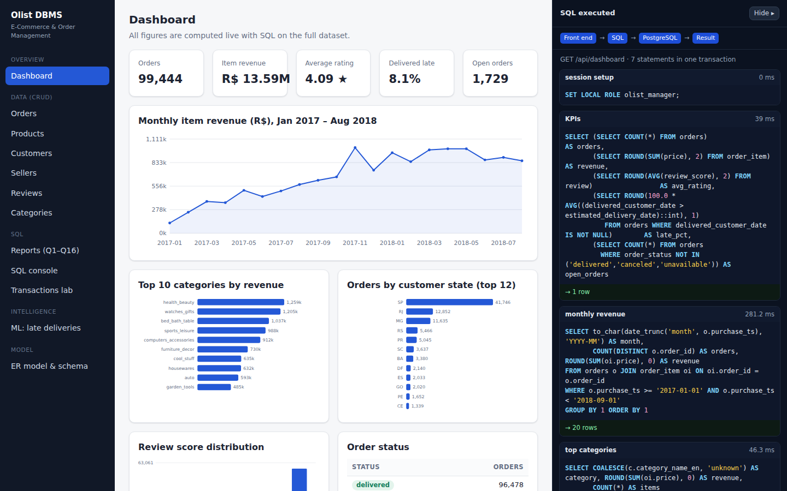

</div>

---

## 📑 Table of contents

- [About](#-about)
- [Features](#-features)
- [Tech stack](#-tech-stack)
- [Architecture](#-architecture)
- [ER diagram](#-er-diagram)
- [Dataset](#-dataset)
- [Quick start](#-quick-start)
- [Demo users & roles](#-demo-users--roles)
- [Project structure](#-project-structure)
- [Database design](#-database-design)
- [SQL coverage](#-sql-coverage)
- [Machine learning: late-delivery prediction](#-machine-learning-late-delivery-prediction)
- [Screenshots](#-screenshots)
- [Troubleshooting](#-troubleshooting)
- [Acknowledgements](#-acknowledgements)

---

## 📖 About

This project turns the public **Olist** marketplace dataset (9 CSV files, 99,441 orders, Sep 2016 – Oct 2018) into a normalized **PostgreSQL** database and builds everything a DBMS course asks for on top of it:

| Requirement | Where it lives |
|---|---|
| Entities, relationships, ER/EER model → relational schema | [ER diagram](#-er-diagram), `db/01_schema.sql` |
| Keys, functional dependencies, normalization to 3NF/BCNF | [Database design](#-database-design), `db/14_normalization_demo.sql` |
| DDL + DML, joins, nested/correlated queries, aggregates, GROUP BY/HAVING | `db/01`–`03`, `db/09_queries.sql`, `db/12_ddl_dml_demo.sql` |
| Views, indexes, triggers, stored procedures | `db/04`–`07`, `db/13_index_demo.sql` |
| Transactions, ACID, concurrency | `db/10_transactions_demo.sql`, `db/11_concurrency_demo.sql`, **Transactions lab** page |
| Security and role-based access control | `db/08_security.sql` (roles, GRANT/REVOKE, row-level security) |
| Web front end: insert / search / update / delete / reports, SQL shown, ER button | `backend/`, `frontend/` |
| AI/ML integrated with the database and front end | `ml/`, **ML insights** page, `ml_model` / `ml_prediction` tables |

> **Front end → SQL → Database → Result.** Every screen has an **"SQL executed"** panel that shows each statement exactly as PostgreSQL received it, with row counts, timings and errors.

---

## ✨ Features

### 🗄️ Database (the core)
- **16 tables in BCNF**, with 27 states, 19,177 zip codes, 96k customers, 3k sellers, 33k products, 112k order lines, 104k payments and 99k reviews.
- **Real data cleaning:** 1,000,163 geolocation rows → one row per zip prefix, outliers removed, missing zips and category translations added, and anomalies kept visible in `v_data_quality`.
- **Constraints everywhere:** PK, FK (`RESTRICT` / `CASCADE` / `SET NULL` chosen per relationship), `UNIQUE` candidate keys and `CHECK` rules.
- **8 views**, including an updatable view `WITH CHECK OPTION`, plus **2 materialized views** that feed the ML model.
- **Indexes:** B-tree, composite, partial, expression and **GIN full-text** (Portuguese) indexes, with `EXPLAIN ANALYZE` before/after demos.
- **6 triggers:** forward-only order status, an audit log, a delete guard, review-after-delivery, stock control and ML prediction invalidation.
- **Stored procedures:** `sp_place_order` (atomic order + items + payment), `sp_update_status`, `sp_cancel_order`, plus scalar functions.
- **Security:** 5 group roles, a least-privilege login role, `SET LOCAL ROLE` per request, **row-level security** for sellers, **column privileges** for analysts and **bcrypt** password hashing inside PostgreSQL (`pgcrypto`).

### 🌐 Web application
- **CRUD** for orders, products, customers, sellers, reviews and categories.
- **Faceted search:** every dropdown shows how many rows each option returns with your other filters. Options are sorted by count, and empty ones are greyed out.
- **Reports Q1–Q16**, each demonstrating one SQL concept, with **EXPLAIN ANALYZE** and **CSV export**.
- A **read-only SQL console** (`SET TRANSACTION READ ONLY`, 15 s timeout).
- A **Transactions lab** with live demos of atomicity, consistency, isolation levels and a lost update with and without `SELECT … FOR UPDATE`.
- An **ER model & schema** page: the Mermaid ER diagram plus tables, keys, constraints, triggers, routines, indexes, RLS policies and grants, all read live from the catalog.

### 🤖 Machine learning
- **Late-delivery risk** (classification) and **delivery-time estimate** (regression) at checkout.
- Features are built **in SQL**; results are stored **in the database** and used live when an order is placed.
- A **"Predict risk only"** button places the order inside a transaction, scores it, then **ROLLBACKs**.

---

## 🧰 Tech stack

| Layer | Technology |
|---|---|
| Database | PostgreSQL 16, PL/pgSQL, pgcrypto |
| Data loading | `psql \copy` + SQL `INSERT … SELECT` (no ORM) |
| Backend | Python 3, Flask, psycopg 3 (client-side binding, so the SQL shown is the SQL executed) |
| Frontend | Plain HTML / CSS / JavaScript, no build step; Mermaid.js bundled for the ER diagram |
| ML | pandas, scikit-learn (Logistic Regression, Random Forest, HistGradientBoosting), optional LightGBM, joblib |

---

## 🏗️ Architecture

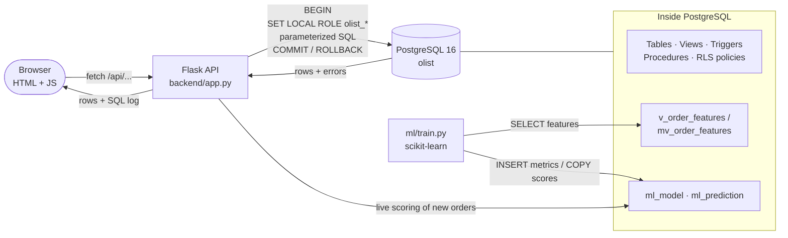

---

## 🗺️ ER diagram

> GitHub renders the diagram below from text. A static image is at [`docs/er_diagram.png`](docs/er_diagram.png), and the app has a **"ER model & schema"** page.

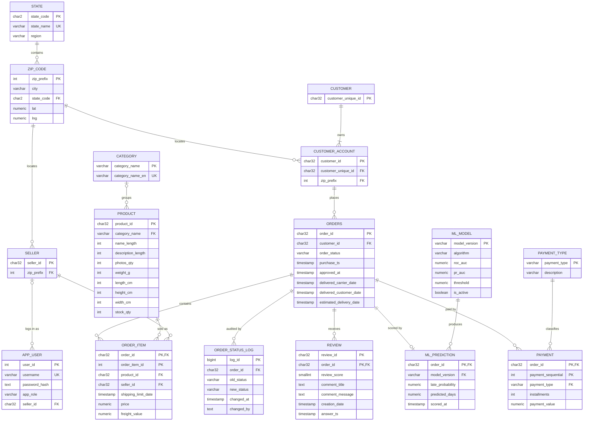

<details>
<summary><b>Static ER diagram (PNG)</b></summary>

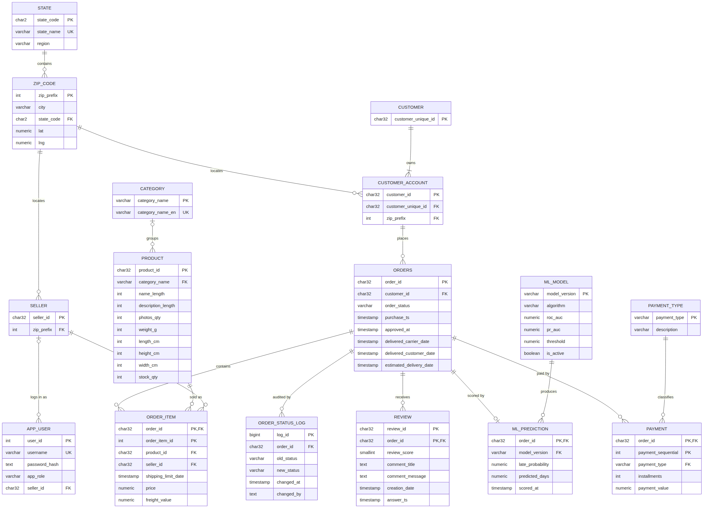

</details>

**Notation:** `||--o{` one to zero-or-many · `||--|{` one to one-or-many · `|o--o{` zero-or-one to many · **PK** primary key · **FK** foreign key · **UK** unique (candidate key).
**Weak entities:** `ORDER_ITEM` and `PAYMENT` (identified by `order_id` + a partial key).

---

## 📦 Dataset

[Brazilian E-Commerce Public Dataset by Olist](https://www.kaggle.com/datasets/olistbr/brazilian-ecommerce) on Kaggle. The CSVs are **not** included in this repository.

| File | Rows | One row is… |
|---|---:|---|
| `olist_orders_dataset.csv` | 99,441 | an order |
| `olist_order_items_dataset.csv` | 112,650 | a line item in an order |
| `olist_order_payments_dataset.csv` | 103,886 | a payment method used on an order |
| `olist_order_reviews_dataset.csv` | 99,224 | a customer review |
| `olist_customers_dataset.csv` | 99,441 | a customer *per order* |
| `olist_sellers_dataset.csv` | 3,095 | a seller |
| `olist_products_dataset.csv` | 32,951 | a product |
| `product_category_name_translation.csv` | 71 | a category (Portuguese → English) |
| `olist_geolocation_dataset.csv` | 1,000,163 | a lat/lng point for a zip prefix |

**Interesting facts found while profiling:** 8.1% of delivered orders arrived late, and late orders average **2.57★** against **4.29★** for on-time ones. Only 3.1% of customers ordered twice. `review_id` is not unique on its own.

---

## 🚀 Quick start

### Prerequisites
- **PostgreSQL 16**, with `psql` on your `PATH` (Windows: add `C:\Program Files\PostgreSQL\16\bin`)
- **Python 3.10+**
- The 9 Olist CSV files

### 1. Place the project next to the data
The scripts expect the CSVs in the folder **above** the project:
```
Dataset/
├── olist_orders_dataset.csv   … (all 9 CSVs)
└── olist-dbms/                ← this repository
```

### 2. Install Python packages
```bash
pip install -r requirements.txt
```
> `lightgbm` is optional. If it fails to install, delete that line and training compares the other models.

### 3. Build, train, run (Windows)
```bat
setup_db.bat       :: creates DB "olist", loads ~560k rows, views, triggers, procedures, security (~1 min)
train_model.bat    :: trains + evaluates the model, stores results in the DB (~1.5 min)
run_app.bat        :: starts the app and opens http://localhost:5000
```

<details>
<summary><b>macOS / Linux (manual commands)</b></summary>

```bash
createdb -U postgres olist
psql -U postgres -d olist -v ON_ERROR_STOP=1 \
     -v datadir="$(cd .. && pwd)" -v dbdir="$(pwd)/db" -f "$(pwd)/db/00_run_all.sql"
PGUSER=postgres PGDATABASE=olist python ml/train.py
python backend/app.py        # → http://localhost:5000
```
Use **absolute** paths for `-f`, `datadir` and `dbdir`.
</details>

### 4. Explore the SQL demo scripts
```bash
psql -U postgres -d olist -f db/09_queries.sql            # Q1–Q16
psql -U postgres -d olist -f db/10_transactions_demo.sql  # ACID
psql -U postgres -d olist -f db/13_index_demo.sql         # EXPLAIN ANALYZE with / without indexes
psql -U postgres -d olist -f db/14_normalization_demo.sql # anomalies + FD checks
```
`db/11_concurrency_demo.sql` is a step-by-step script for **two psql windows**.

---

## 👥 Demo users & roles

Password = username + `123` (e.g. `admin` / `admin123`).

| User | PostgreSQL role | What the database allows |
|---|---|---|
| `admin` | `olist_admin` | everything, including user management |
| `manager` | `olist_manager` | CRUD on business tables, stored procedures, all views |
| `analyst` | `olist_analyst` | read-only; `zip_code.lat/lng` hidden by **column privileges** |
| `seller` | `olist_seller` | only orders containing its own items (**row-level security**); can update status |
| `support` | `olist_support` | reads orders and a privacy view of customers; can mark reviews answered |

The app logs in as **`olist_app`** (`NOINHERIT`, no data privileges of its own) and runs `SET LOCAL ROLE` for every request, so **PostgreSQL enforces the permissions, not the app**.
⚠️ Demo passwords (`olist_app_pw`, `*123`) are for coursework only.

---

## 🗂️ Project structure

```
olist-dbms/
├── setup_db.bat · train_model.bat · run_app.bat · requirements.txt
├── db/                              ← pure SQL, run by psql
│   ├── 00_run_all.sql               runs 01–08 in order
│   ├── 01_schema.sql                DDL: tables + PK / FK / UNIQUE / CHECK
│   ├── 02_staging_load.sql          \copy the 9 CSVs into schema "staging"
│   ├── 03_transform.sql             clean + INSERT … SELECT into normalized tables
│   ├── 04_indexes.sql               B-tree, composite, partial, expression, GIN
│   ├── 05_views.sql                 views, WITH CHECK OPTION, materialized feature views
│   ├── 06_triggers.sql              business-rule and audit triggers
│   ├── 07_procedures.sql            procedures + functions (incl. fn_login)
│   ├── 08_security.sql              roles, grants, column privileges, RLS, demo users
│   ├── 09_queries.sql               Q1–Q16 (generated from backend/queries.py)
│   ├── 10_transactions_demo.sql     ACID
│   ├── 11_concurrency_demo.sql      lost update, isolation levels, serializable, deadlock
│   ├── 12_ddl_dml_demo.sql          ALTER / RENAME / TRUNCATE / DROP + DML (rolled back)
│   ├── 13_index_demo.sql            EXPLAIN ANALYZE with vs. without indexes
│   └── 14_normalization_demo.sql    update / insert / delete anomalies, FD checks
├── backend/
│   ├── app.py                       Flask API (every response includes the SQL log)
│   ├── db.py                        per-request transaction + SET LOCAL ROLE + SQL log
│   ├── queries.py                   the 16 report queries
│   ├── ml_service.py                loads the model, scores orders
│   └── export_queries.py            regenerates db/09_queries.sql
├── ml/
│   ├── common.py                    feature lists, DB I/O
│   ├── train.py                     time-series CV, test evaluation, writes results to DB
│   └── models/                      trained model (created by train_model.bat, git-ignored)
├── frontend/                        index.html · app.js · style.css · er.js · vendor/mermaid
└── docs/                            er_diagram.png · screenshots/
```

---

## 🧮 Database design

### Keys

| Table | Primary key | Other candidate keys | Foreign keys |
|---|---|---|---|
| `state` | `state_code` | `state_name` | – |
| `zip_code` | `zip_prefix` | – | `state_code → state` |
| `customer` | `customer_unique_id` | – | – |
| `customer_account` | `customer_id` | – | `customer_unique_id → customer`, `zip_prefix → zip_code` |
| `seller` | `seller_id` | – | `zip_prefix → zip_code` |
| `category` | `category_name` | `category_name_en` | – |
| `product` | `product_id` | – | `category_name → category` |
| `orders` | `order_id` | – | `customer_id → customer_account` |
| `order_item` | `(order_id, order_item_id)` | – | `order_id`, `product_id`, `seller_id` |
| `payment` | `(order_id, payment_sequential)` | – | `order_id`, `payment_type` |
| `review` | `(review_id, order_id)` | – | `order_id` (review_id alone repeats 814×) |

### Functional dependencies
```
order_id                        → customer_id, order_status, purchase_ts, approved_at, delivered_*, estimated_delivery_date
customer_id                     → customer_unique_id, zip_prefix
zip_prefix                      → city, state_code
state_code                      → state_name, region
(order_id, order_item_id)       → product_id, seller_id, shipping_limit_date, price, freight_value
product_id                      → category_name, name/description length, photos_qty, weight, dimensions, stock_qty
category_name ↔ category_name_en
seller_id                       → zip_prefix
(order_id, payment_sequential)  → payment_type, installments, payment_value
(review_id, order_id)           → review_score, comment_title, comment_message, creation_date, answer_ts
```

### Normalization
| Step | What was removed | Result |
|---|---|---|
| **1NF** | repeating groups (items, payments inside an order) | `order_item`, `payment` rows |
| **2NF** | partial dependencies on `(order_id, order_item_id)` | `orders` and `product` split from `order_item` |
| **3NF** | transitive dependencies: `customer → zip → city/state`, `product → category → English name`, `payment_type → description` | `zip_code`, `state`, `category`, `payment_type` |
| **BCNF** | every determinant is a candidate key (`category` has two) | all 16 tables in BCNF |

`db/14_normalization_demo.sql` rebuilds the flat table from real data and shows the **update, insert and delete anomalies** it would have.

---

## 🧾 SQL coverage

| # | Concept | Question answered |
|---|---|---|
| Q1 | INNER JOIN (5 tables) | Order lines with category and seller city |
| Q2 | LEFT JOIN + IS NULL | Delivered orders never reviewed |
| Q3 | SELF JOIN | Category pairs bought together |
| Q4 | Aggregates + GROUP BY | Monthly orders, revenue, average ticket |
| Q5 | GROUP BY + HAVING | Busy sellers with poor ratings |
| Q6 | Subquery with IN | Customers of the #1 revenue category |
| Q7 | Correlated subqueries | Loyal customers (3+ orders) and their spend |
| Q8 | EXISTS / NOT EXISTS | Sellers with a 1★ review but no cancellations |
| Q9 | Derived table | States faster than the national delivery average |
| Q10 | Scalar subqueries + function | Orders with item count, total, amount paid |
| Q11 | UNION / INTERSECT / EXCEPT | States with customers, sellers or both |
| Q12 | CASE in aggregates | On-time vs late share and rating by state |
| Q13 | Window functions (LAG, running SUM, RANK) | Month-over-month revenue growth |
| Q13b | RANK() OVER (PARTITION BY) | Top 3 products in the 5 biggest categories |
| Q14 | CTE + recursive CTE | New customers and lifetime value per month |
| Q15 | ALL / ANY | Products heavier than every telephony product |
| Q16 | Full-text search (GIN) | Reviews mentioning a word (Portuguese stemming) |

---

## 🤖 Machine learning: late-delivery prediction

**Question:** *at checkout, will this order arrive after the promised date, and how many days will it take?*

| | |
|---|---|
| **Why this task** | Lateness is the strongest driver of bad reviews (2.57★ vs 4.29★). Recommendation was rejected because only 3.1% of customers buy twice. |
| **Features (SQL view `v_order_features`)** | states and region, haversine distance from zip coordinates, items, sellers, price, freight, freight ratio, weight, volume, category, payment type, installments, month / weekday / hour, promised days, shipping-limit days, the seller's past orders and late rate |
| **Leakage control** | seller history uses only deliveries completed **before** the purchase; delivery dates are never used as features |
| **Validation** | rolling **time-series cross-validation** (3 folds) → model selection by mean ROC-AUC → threshold tuned on out-of-fold predictions → one final test on **Jun–Aug 2018** |
| **Models compared** | distance-rule baseline, Logistic Regression, Random Forest, HistGradientBoosting (+ LightGBM if installed) |

### Results on the untouched test months (late rate 5.5%)

| Metric | Value |
|---|---|
| ROC-AUC | **0.72** |
| PR-AUC | **0.11** (2× the base rate) |
| Recall at chosen threshold | **66%** |
| Delivery-time error (regression) | **3.5 days**, vs **12.7 days** for Olist's own promised date |

> **Honest caveat:** the monthly late rate swings between 1.4% and 21% (e.g. the May 2018 truckers' strike), so lateness is hard to predict from checkout data alone. This concept drift is why time-based validation matters. The delivery-time estimate is the more useful output.

**Integration with the database and UI:** metrics go to `ml_model`, scores to `ml_prediction`, and `v_high_risk_orders` joins them back for SQL users. New orders are scored live, and the ML page computes the confusion matrix and risk deciles **in SQL**.

---

## 📸 Screenshots

| | |
|---|---|
| **Faceted order search + SQL panel**<br>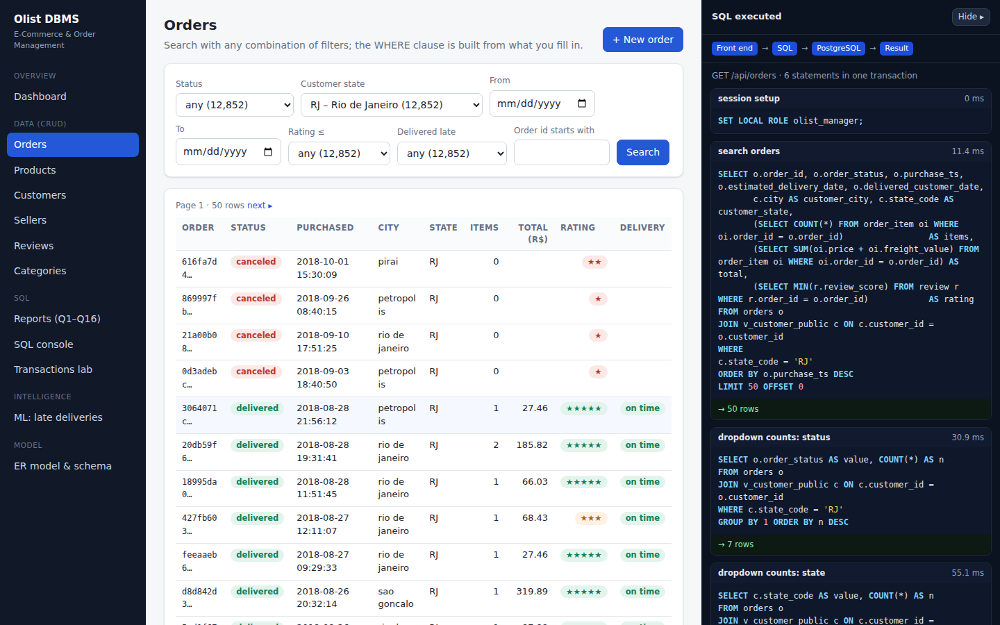 | **Order detail with ML risk + audit trail**<br>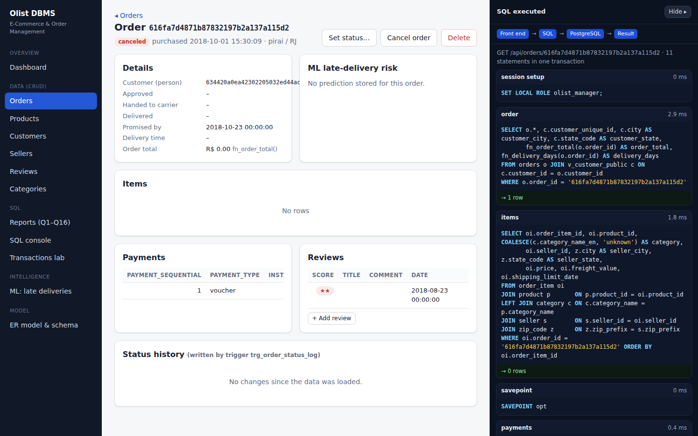 |
| **Reports (Q1–Q16) with EXPLAIN**<br>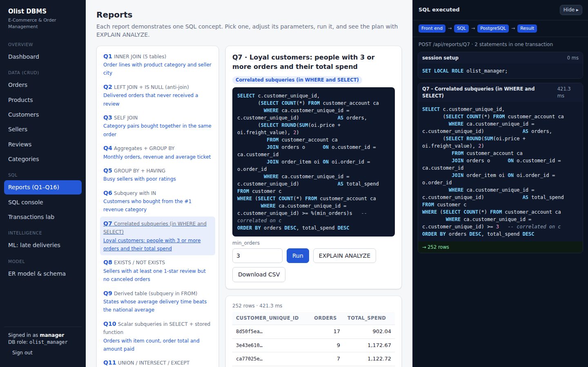 | **Transactions & concurrency lab**<br>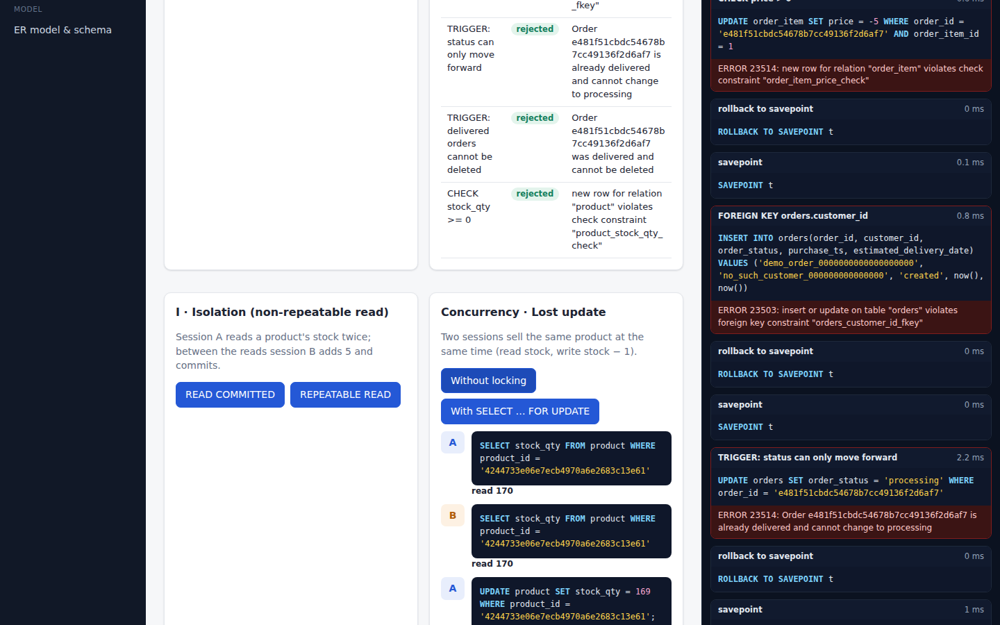 |
| **ML insights**<br>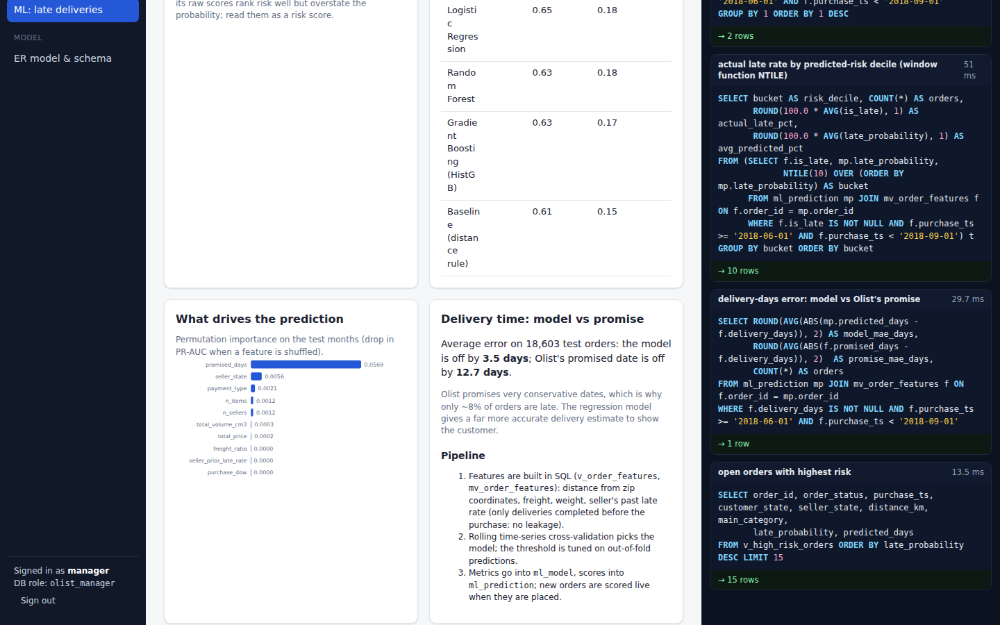 | **What-if prediction (ROLLBACK)**<br>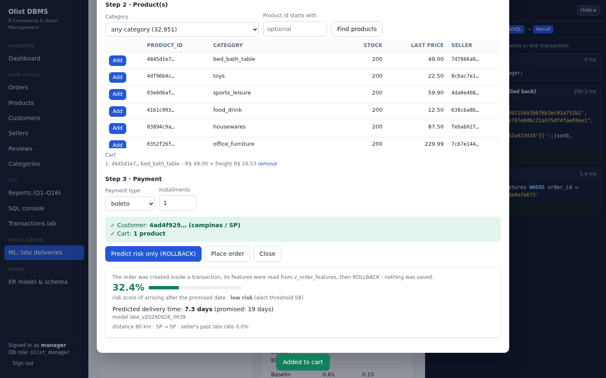 |
| **Row-level security: seller view**<br>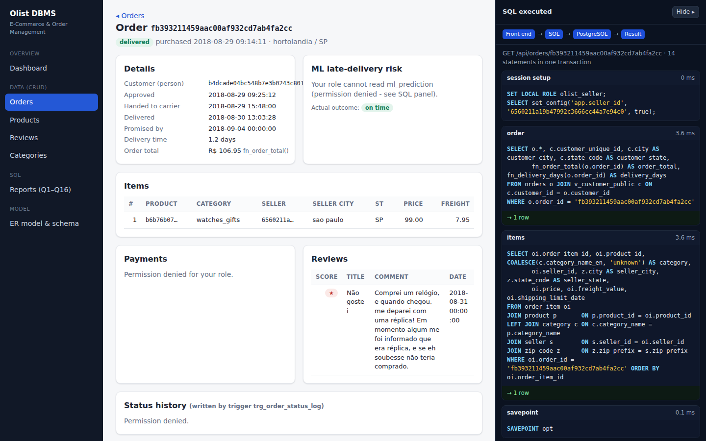 | **ER model inside the app**<br>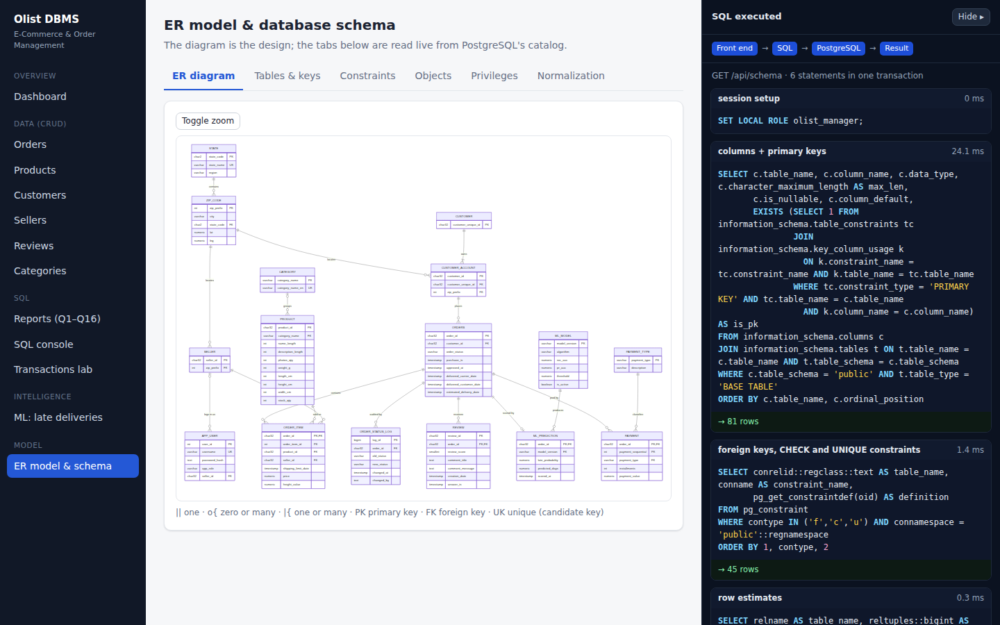 |

---

## 🛠️ Troubleshooting

| Problem | Fix |
|---|---|
| `psql is not recognized` | Add `C:\Program Files\PostgreSQL\16\bin` to PATH and open a **new** terminal |
| `Could not find the Olist CSV files` | Put the project folder inside the folder that holds the CSVs, or edit `DATADIR` in `setup_db.bat` |
| `password authentication failed for user "olist_app"` | Re-run `setup_db.bat` (it recreates roles and privileges) |
| ML page says "No trained model yet" | Run `train_model.bat`, then reload the page |
| Page looks outdated after an update | Restart `run_app.bat` and press **Ctrl + F5** in the browser |

---

## 🙏 Acknowledgements

- Data: [Olist Brazilian E-Commerce Public Dataset](https://www.kaggle.com/datasets/olistbr/brazilian-ecommerce) (CC BY-NC-SA 4.0)
- ER diagrams rendered with [Mermaid](https://mermaid.js.org/)
- Built as a DBMS course project: *E-Commerce and Order Management*
