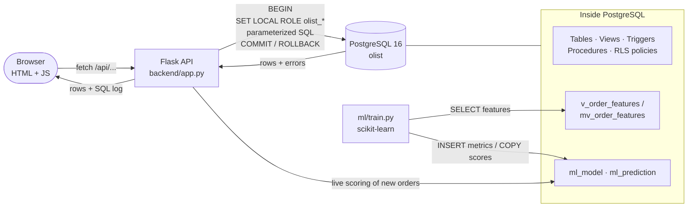
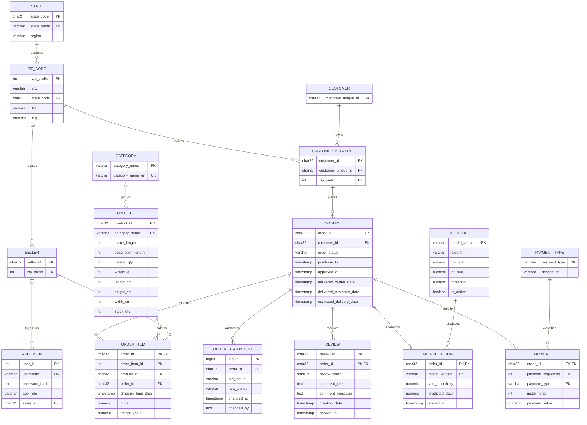

# System Design Document
**Project:** E-Commerce & Order Management System (Olist)  
**Course:** Software Engineering & Project Management (SEPM)  
**Team:** Tarush Banke · Tanishk Varshney · Tanishq Mahajan  
**Version:** 1.0 (mid-semester)

This document describes *how* the system is built: architecture, data model, database design, the SQL catalogue and the machine-learning component. The requirements it satisfies are listed in [SRS.md](SRS.md).

---

## 1. Architecture



**Design decisions**

| Decision | Alternatives considered | Reason |
|---|---|---|
| Layered (client / API / DB) architecture | Monolithic server-rendered pages | Clear separation lets each member own one layer and test it independently |
| Business rules in the database (constraints, triggers, procedures, RLS) | Rules in Python only | Rules hold for every client (web app, psql, ML script); the DBMS is the course focus |
| Raw SQL through psycopg, no ORM | SQLAlchemy ORM | The SQL executed must be visible to the user (Front end → SQL → DB → Result) |
| Vanilla JS front end, no build step | React / Angular | Zero setup for evaluators; the front end only needs to demonstrate DB features |
| Per-request `SET LOCAL ROLE` | One all-powerful DB user | PostgreSQL itself enforces least privilege and row-level security |

---

## 2. Technology stack

| Layer | Technology |
|---|---|
| Database | PostgreSQL 16, PL/pgSQL, pgcrypto |
| Data loading | `psql \copy` + SQL `INSERT … SELECT` (no ORM) |
| Backend | Python 3, Flask, psycopg 3 (client-side binding, so the SQL shown is the SQL executed) |
| Frontend | Plain HTML / CSS / JavaScript, no build step; Mermaid.js bundled for the ER diagram |
| ML | pandas, scikit-learn (Logistic Regression, Random Forest, HistGradientBoosting), optional LightGBM, joblib |

---

## 3. ER model

> GitHub renders the diagram below from text. A static image is at [`er_diagram.png`](er_diagram.png), and the app has a **"ER model & schema"** page.



<details>
<summary><b>Static ER diagram (PNG)</b></summary>


</details>

**Notation:** `||--o{` one to zero-or-many · `||--|{` one to one-or-many · `|o--o{` zero-or-one to many · **PK** primary key · **FK** foreign key · **UK** unique (candidate key).
**Weak entities:** `ORDER_ITEM` and `PAYMENT` (identified by `order_id` + a partial key).

---

## 4. Relational design: keys, dependencies, normalization

### 4.1 Keys

| Table | Primary key | Other candidate keys | Foreign keys |
|---|---|---|---|
| `state` | `state_code` | `state_name` | – |
| `zip_code` | `zip_prefix` | – | `state_code → state` |
| `customer` | `customer_unique_id` | – | – |
| `customer_account` | `customer_id` | – | `customer_unique_id → customer`, `zip_prefix → zip_code` |
| `seller` | `seller_id` | – | `zip_prefix → zip_code` |
| `category` | `category_name` | `category_name_en` | – |
| `product` | `product_id` | – | `category_name → category` |
| `orders` | `order_id` | – | `customer_id → customer_account` |
| `order_item` | `(order_id, order_item_id)` | – | `order_id`, `product_id`, `seller_id` |
| `payment` | `(order_id, payment_sequential)` | – | `order_id`, `payment_type` |
| `review` | `(review_id, order_id)` | – | `order_id` (review_id alone repeats 814×) |

### 4.2 Functional dependencies
```
order_id                        → customer_id, order_status, purchase_ts, approved_at, delivered_*, estimated_delivery_date
customer_id                     → customer_unique_id, zip_prefix
zip_prefix                      → city, state_code
state_code                      → state_name, region
(order_id, order_item_id)       → product_id, seller_id, shipping_limit_date, price, freight_value
product_id                      → category_name, name/description length, photos_qty, weight, dimensions, stock_qty
category_name ↔ category_name_en
seller_id                       → zip_prefix
(order_id, payment_sequential)  → payment_type, installments, payment_value
(review_id, order_id)           → review_score, comment_title, comment_message, creation_date, answer_ts
```

### 4.3 Normalization
| Step | What was removed | Result |
|---|---|---|
| **1NF** | repeating groups (items, payments inside an order) | `order_item`, `payment` rows |
| **2NF** | partial dependencies on `(order_id, order_item_id)` | `orders` and `product` split from `order_item` |
| **3NF** | transitive dependencies: `customer → zip → city/state`, `product → category → English name`, `payment_type → description` | `zip_code`, `state`, `category`, `payment_type` |
| **BCNF** | every determinant is a candidate key (`category` has two) | all 16 tables in BCNF |

`db/14_normalization_demo.sql` rebuilds the flat table from real data and shows the **update, insert and delete anomalies** it would have.

---

## 5. SQL query catalogue (Q1–Q16)

| # | Concept | Question answered |
|---|---|---|
| Q1 | INNER JOIN (5 tables) | Order lines with category and seller city |
| Q2 | LEFT JOIN + IS NULL | Delivered orders never reviewed |
| Q3 | SELF JOIN | Category pairs bought together |
| Q4 | Aggregates + GROUP BY | Monthly orders, revenue, average ticket |
| Q5 | GROUP BY + HAVING | Busy sellers with poor ratings |
| Q6 | Subquery with IN | Customers of the #1 revenue category |
| Q7 | Correlated subqueries | Loyal customers (3+ orders) and their spend |
| Q8 | EXISTS / NOT EXISTS | Sellers with a 1★ review but no cancellations |
| Q9 | Derived table | States faster than the national delivery average |
| Q10 | Scalar subqueries + function | Orders with item count, total, amount paid |
| Q11 | UNION / INTERSECT / EXCEPT | States with customers, sellers or both |
| Q12 | CASE in aggregates | On-time vs late share and rating by state |
| Q13 | Window functions (LAG, running SUM, RANK) | Month-over-month revenue growth |
| Q13b | RANK() OVER (PARTITION BY) | Top 3 products in the 5 biggest categories |
| Q14 | CTE + recursive CTE | New customers and lifetime value per month |
| Q15 | ALL / ANY | Products heavier than every telephony product |
| Q16 | Full-text search (GIN) | Reviews mentioning a word (Portuguese stemming) |

---

## 6. AI/ML component: late-delivery prediction

**Question:** *at checkout, will this order arrive after the promised date, and how many days will it take?*

| | |
|---|---|
| **Why this task** | Lateness is the strongest driver of bad reviews (2.57★ vs 4.29★). Recommendation was rejected because only 3.1% of customers buy twice. |
| **Features (SQL view `v_order_features`)** | states and region, haversine distance from zip coordinates, items, sellers, price, freight, freight ratio, weight, volume, category, payment type, installments, month / weekday / hour, promised days, shipping-limit days, the seller's past orders and late rate |
| **Leakage control** | seller history uses only deliveries completed **before** the purchase; delivery dates are never used as features |
| **Validation** | rolling **time-series cross-validation** (3 folds) → model selection by mean ROC-AUC → threshold tuned on out-of-fold predictions → one final test on **Jun–Aug 2018** |
| **Models compared** | distance-rule baseline, Logistic Regression, Random Forest, HistGradientBoosting (+ LightGBM if installed) |

### 6.1 Results on the untouched test months (late rate 5.5%)

| Metric | Value |
|---|---|
| ROC-AUC | **0.72** |
| PR-AUC | **0.11** (2× the base rate) |
| Recall at chosen threshold | **66%** |
| Delivery-time error (regression) | **3.5 days**, vs **12.7 days** for Olist's own promised date |

> **Honest caveat:** the monthly late rate swings between 1.4% and 21% (e.g. the May 2018 truckers' strike), so lateness is hard to predict from checkout data alone. This concept drift is why time-based validation matters. The delivery-time estimate is the more useful output.

**Integration with the database and UI:** metrics go to `ml_model`, scores to `ml_prediction`, and `v_high_risk_orders` joins them back for SQL users. New orders are scored live, and the ML page computes the confusion matrix and risk deciles **in SQL**.

---

## 7. Dataset

[Brazilian E-Commerce Public Dataset by Olist](https://www.kaggle.com/datasets/olistbr/brazilian-ecommerce) on Kaggle. The CSVs are **not** included in this repository.

| File | Rows | One row is… |
|---|---:|---|
| `olist_orders_dataset.csv` | 99,441 | an order |
| `olist_order_items_dataset.csv` | 112,650 | a line item in an order |
| `olist_order_payments_dataset.csv` | 103,886 | a payment method used on an order |
| `olist_order_reviews_dataset.csv` | 99,224 | a customer review |
| `olist_customers_dataset.csv` | 99,441 | a customer *per order* |
| `olist_sellers_dataset.csv` | 3,095 | a seller |
| `olist_products_dataset.csv` | 32,951 | a product |
| `product_category_name_translation.csv` | 71 | a category (Portuguese → English) |
| `olist_geolocation_dataset.csv` | 1,000,163 | a lat/lng point for a zip prefix |

**Interesting facts found while profiling:** 8.1% of delivered orders arrived late, and late orders average **2.57★** against **4.29★** for on-time ones. Only 3.1% of customers ordered twice. `review_id` is not unique on its own.
