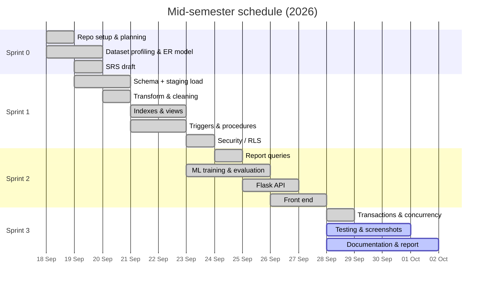

# Project Management Plan & Records

**Project:** E-Commerce & Order Management System (Olist)
**Course:** Software Engineering & Project Management (SEPM)
**Team:** Tarush Banke (project lead) · Tanishk Varshney · Tanishq Mahajan
**Period covered:** 18 Sep 2026 → 1 Oct 2026 (mid-semester release)

---

## 1. Process model and team organisation

**Model:** Agile Scrum with 4 short sprints. We picked Scrum over Waterfall because the high-level requirements (course rubric) were fixed, but the details depended on what we found in the data. For example, the ML task changed from *product recommendation* to *late-delivery prediction* once profiling showed that only 3.1% of customers order twice.

| Scrum role | Member |
|---|---|
| Product owner (represents course requirements) | Tarush Banke |
| Scrum master (runs stand-ups, tracks the board) | Tarush Banke |
| Development team | Tarush Banke, Tanishk Varshney, Tanishq Mahajan |

**Team structure:** each member owns one layer (database, back end, front end + ML), and all three review and test each other's work.

**Communication:** online stand-up on most days (about 15 min), a group chat for quick questions, and a sprint review + retrospective call at the end of each sprint.

**Tools:** Git + GitHub (version control), a shared task board (backlog → in progress → review → done), VS Code, PostgreSQL 16 / psql, Python, Mermaid (diagrams).

---

## 2. Work breakdown structure

```
1 E-Commerce & Order Management System
├── 1.1 Project management
│   ├── 1.1.1 Planning, sprint planning, task board           (Tarush)
│   ├── 1.1.2 Risk register, meeting minutes                  (Tarush)
│   └── 1.1.3 Mid-semester report and demo video              (All)
├── 1.2 Requirements
│   ├── 1.2.1 Dataset profiling                               (Tarush, Tanishq)
│   └── 1.2.2 SRS: functional / non-functional requirements   (Tarush)
├── 1.3 Database design & implementation
│   ├── 1.3.1 ER/EER model, relational schema                 (Tarush)
│   ├── 1.3.2 Keys, FDs, normalization to BCNF                (Tarush)
│   ├── 1.3.3 Staging load, cleaning, transform               (Tarush)
│   ├── 1.3.4 Indexes and views                               (Tarush)
│   ├── 1.3.5 Triggers and stored procedures                  (Tanishk)
│   ├── 1.3.6 Security: roles, grants, RLS                    (Tanishk)
│   └── 1.3.7 Transactions and concurrency demos              (Tanishk)
├── 1.4 Application
│   ├── 1.4.1 DB access layer + Flask API                     (Tanishk)
│   ├── 1.4.2 Report queries Q1–Q16                           (Tanishk)
│   ├── 1.4.3 Front end: CRUD, search, reports, lab           (Tanishq)
│   └── 1.4.4 ER model & schema page                          (Tanishq)
├── 1.5 AI/ML
│   ├── 1.5.1 Problem framing, feature view in SQL            (Tanishq, Tarush)
│   ├── 1.5.2 Training, model selection, evaluation           (Tanishq)
│   └── 1.5.3 Integration with DB and UI                      (Tanishq, Tanishk)
└── 1.6 Testing & documentation
    ├── 1.6.1 Test plan and test execution                    (Tanishq)
    ├── 1.6.2 Design document, README                         (Tarush)
    └── 1.6.3 Screenshots / evidence                          (Tanishq)
```

---

## 3. Schedule

### 3.1 Sprint plan

| Sprint | Dates | Goal | Deliverables | Status |
|---|---|---|---|---|
| 0 | 18–19 Sep | Understand the problem, set up the project | Repo, dataset profile, ER model v1, SRS draft | Done |
| 1 | 20–23 Sep | Working database with all rules | Schema, load + cleaning, indexes, views, triggers, procedures, security | Done |
| 2 | 24–27 Sep | Usable application + ML model | Flask API, front end, reports Q1–Q16, trained model | Done |
| 3 | 28 Sep–1 Oct | Hardening and release | Transaction/concurrency demos, testing, docs, mid-sem report | In progress |

### 3.2 Gantt chart



---

## 4. Effort estimation

**Basic COCOMO (organic mode)** on the delivered code, excluding the bundled Mermaid library:

| Item | Value |
|---|---|
| Size | ≈ 4.9 KLOC (SQL 1.7k, Python 2.0k, JS/CSS/HTML 1.2k) |
| Effort E = 2.4 × KLOC^1.05 | ≈ 12.8 person-months |
| Duration D = 2.5 × E^0.38 | ≈ 6.6 months |
| Average staff E / D | ≈ 1.9 people |

**Actual:** 3 people × ~2 weeks, i.e. about 1.5 person-months.

**Why the gap:** COCOMO is calibrated on industrial projects that include full requirements, formal reviews, documentation, deployment and maintenance, whereas this is a scoped academic release. SQL is also very dense: one line can express a join over five tables, and PostgreSQL does most of the work (constraints, RLS, window functions). We take the COCOMO figure as an upper bound, and it is one reason we cut some features from the scope (see section 1.2 of the SRS and "Out of scope" in the README).

---

## 5. Risk management

| ID | Risk | Probability | Impact | Mitigation | Status |
|---|---|---|---|---|---|
| R1 | Dataset quality problems (duplicates, missing zips, untranslated categories) break loading | High | High | Load into a text-only staging schema first; clean in SQL; expose problems in `v_data_quality` | Closed: 278 + 7 missing zips and 2 categories handled |
| R2 | Chosen ML task not learnable from the data | Medium | High | Profile data before choosing; keep a simple baseline; honest metrics | Occurred: switched recommendation → late-delivery prediction |
| R3 | Data leakage makes ML metrics look better than they are | Medium | High | Time-based split; seller history uses only past deliveries; delivery dates never used as features | Controlled |
| R4 | Team members blocked by each other (API needs schema, UI needs API) | Medium | Medium | Schema frozen at the end of Sprint 1; API contract agreed before UI work | Controlled |
| R5 | Security mistakes (SQL injection, over-privileged app user) | Low | High | Bound parameters only; `olist_app` has no privileges of its own; RLS tested with the seller role | Controlled |
| R6 | Environment differences (Windows paths, PostgreSQL not on PATH) | High | Medium | `.bat` scripts check prerequisites; README troubleshooting table | Occurred once (PostgreSQL service missing on one laptop); fixed with a check in `run_app.bat` |
| R7 | Schedule slip before the mid-semester deadline | Medium | High | Must-have vs nice-to-have list; nice-to-haves (LightGBM, what-if prediction) done last | Open, on track |
| R8 | Loss of work | Low | High | Everything in Git, pushed daily | Controlled |
| R9 | Secrets committed to the repository | Low | Medium | `.gitignore` for `.env`; only documented demo passwords used | Controlled |

---

## 6. Meeting minutes

> Summary records of the team's meetings. Each entry lists decisions and action items.

**M1: Kick-off (18 Sep)** · Present: all
- Chose the Olist dataset for the e-commerce topic (real data, 9 related tables).
- Agreed on PostgreSQL + Flask + vanilla JS; Scrum with 4 sprints.
- Actions: Tarush sets up the repo and schema draft; Tanishq profiles the CSVs; Tanishk checks PostgreSQL features for security (RLS).

**M2: Sprint 0 review (19 Sep)** · Present: all
- ER model accepted: 16 tables, `review` needs a composite key because `review_id` repeats.
- Profiling: 8.1% of orders are late, late orders average 2.57★ vs 4.29★.
- Actions: Tarush writes the staging load and transform; Tanishk starts the triggers.

**M3: Sprint 1 mid-point (21 Sep)** · Present: all
- Decided to put business rules in triggers and procedures, not in Flask.
- Agreed on 5 application roles mapped to PostgreSQL group roles.
- Actions: Tanishk writes the security script; Tarush writes indexes and views.

**M4: Sprint 1 review + retro (23 Sep)** · Present: all
- Database builds from scratch in about 1 minute. ✔
- Retro: loading took longer than planned because of dirty geolocation data. Next time we profile before writing the DDL.
- ML task changed to late-delivery prediction (recommendation not viable, R2).
- Actions: Tanishq trains the model; Tanishk builds the API; Tarush writes the feature view.

**M5: Sprint 2 mid-point (25 Sep)** · Present: all
- API contract agreed: every response returns `data` plus a `queries` log for the SQL panel.
- Model results: ROC-AUC 0.72 on held-out months; accepted with an honest caveat about concept drift.

**M6: Sprint 2 review + retro (27 Sep)** · Present: all
- All pages working end to end with the SQL panel.
- Retro: integration was smooth because of the agreed API contract.
- Actions: Tanishk adds the transaction/concurrency demos; Tanishq writes the test plan and screenshots; Tarush writes the docs.

**M7: Sprint 3 check-in (29 Sep)** · Present: all
- Fixed: the home page `/` returned 404 and the app gave an unclear error when PostgreSQL was not running.
- Actions: finish the report, record the demo video, and each member prepares to explain their part.

---

## 7. Configuration management

- **Repository:** single `main` branch, small commits, each commit authored by the member who did the work.
- **Not versioned:** the dataset CSVs (licence + size), the trained model file (reproducible with `train_model.bat`), `__pycache__`, `.env`.
- **Reproducibility:** `setup_db.bat` → `train_model.bat` → `run_app.bat` rebuilds the whole system from the CSVs.
- **Versioning:** `v1.0` = mid-semester release.
